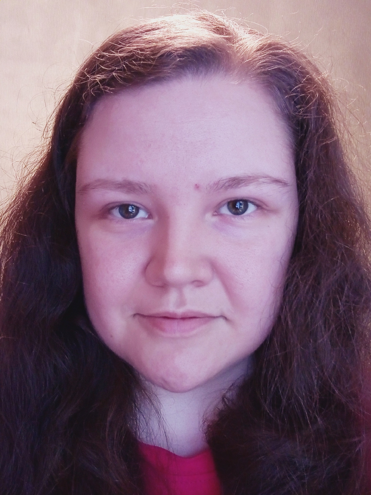

1. Aleksandra Ivashko
2. **phone number:** +7-916-453-98-91
**e-mail:** lessandra.ivasko@gmail.com
**github:** @lessandra-ivasko
3. My goal is to become an IT specialist and find first job. I like to study and learn new things.
4. **skills:** python, pandas, numpy, matplotlib, seaborn, sklearn
5.
```javascript
function multiply(a, b){
  return a * b
}
```
6. **CV:** https://github.com/lessandra-ivasko/rsschool-cv
7. **Lower post-secondary vocational education:** Information systems and Programming
8. **English level:** B1